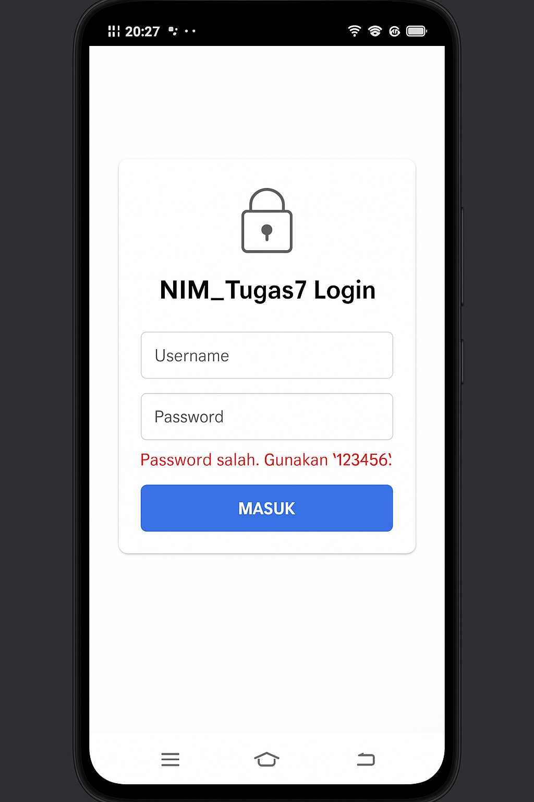
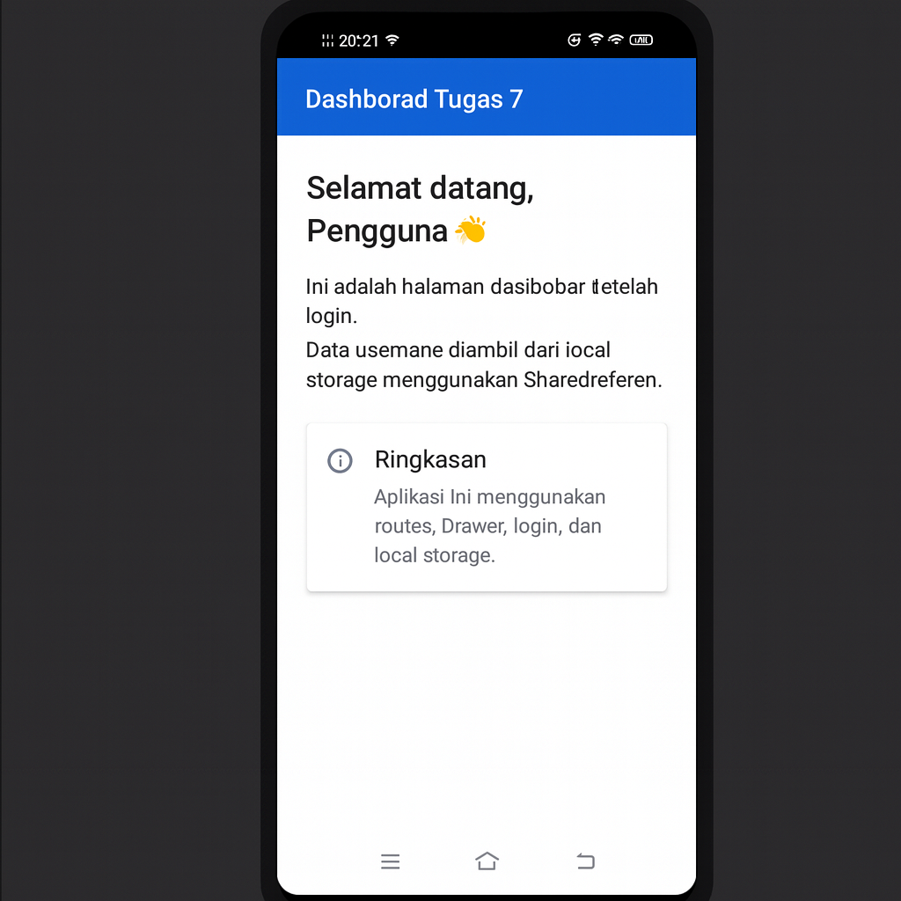
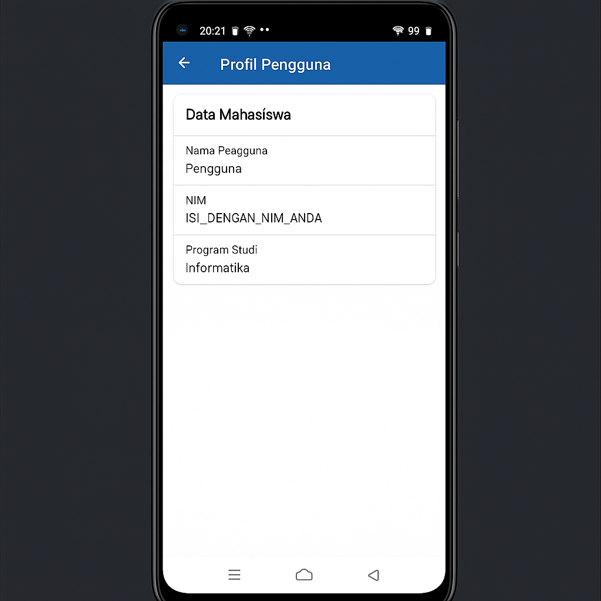
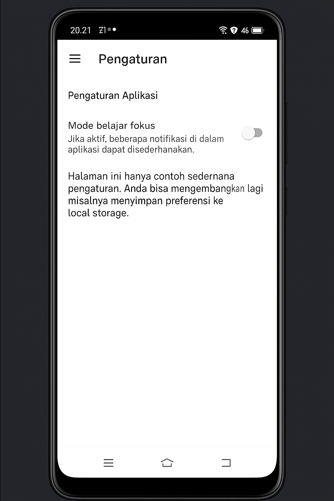

# h1d023009_tugas7
**Nama : Hidayatul Mangunah
NIM : H1D023009
Shift Lama : F
Shift Baru : E**

# Tugas 7 Pemrograman Mobile – Flutter  
Fitur utama:
- Login dengan validasi sederhana
- Navigasi menggunakan **named routes**
- Side menu menggunakan **Drawer**
- Penyimpanan data lokal menggunakan **SharedPreferences**

Penjelasan Tiap Bagian Kode
**1. main.dart**
main() memanggil WidgetsFlutterBinding.ensureInitialized() lalu membaca status login (LocalStorageService.getIsLoggedIn()).
Nilai isLoggedIn dikirim ke MyApp, lalu dipakai untuk menentukan initialRoute:
Jika true → langsung ke /home
Jika false → ke /login
MaterialApp menggunakan routes untuk mendaftarkan halaman:
/login → LoginScreen
/home → HomeScreen
/profile → ProfileScreen
/settings → SettingsScreen

**2. routes.dart**
Berisi class AppRoutes yang menyimpan nama-nama route sebagai static const.
Tujuan: menghindari typo string route dan mempermudah pengelolaan.

**3. local_storage_service.dart**
Menggunakan SharedPreferences untuk menyimpan:
is_logged_in (tipe bool) → status login
username (tipe String) → nama pengguna

Disediakan method:
setLoggedIn(bool value)
getIsLoggedIn()
setUsername(String username)
getUsername()
clearAll() → hapus semua data (dipakai saat logout)

**4. login_screen.dart**
Form login menggunakan Form dan TextFormField:
Field username
Field password (obscure)

Validasi:
Tidak boleh kosong
Password minimal 4 karakter

Logika sederhana:
Jika password = "123456" → login berhasil
Simpan is_logged_in = true dan username ke local storage
Pindah halaman ke /home dengan Navigator.pushNamedAndRemoveUntil
Jika salah → tampilkan pesan error di bawah form

**5. home_screen.dart**
Mengambil username dari local storage di initState() menggunakan LocalStorageService.getUsername().
Menampilkan greeting: "Selamat datang, {username}".
Menjelaskan bahwa data diambil dari local storage.
Menggunakan AppDrawer sebagai side menu.

**6. profile_screen.dart**
Juga mengambil username dari local storage.
Menampilkan data profil dalam bentuk card:
Nama Pengguna → dari SharedPreferences
NIM → diisi manual (menyesuaikan mahasiswa)
Program Studi → contoh: Informatika
Lebih menekankan pemisahan tampilan profil dari dashboard.

**7. settings_screen.dart**
Menggunakan SwitchListTile untuk contoh fitur Mode belajar fokus.
Nilai switch disimpan hanya di state lokal (bisa dikembangkan untuk disimpan ke SharedPreferences).
Menunjukkan bahwa halaman pengaturan bisa diperluas untuk berbagai preferensi.

**8. app_drawer.dart**
UserAccountsDrawerHeader menampilkan nama dan email sederhana.

Menu yang tersedia:
Dashboard → /home
Profil → /profile
Pengaturan → /settings

Keluar:
Memanggil LocalStorageService.clearAll()
Kembali ke halaman login dengan Navigator.pushNamedAndRemoveUntil
Drawer ini dipakai di HomeScreen, ProfileScreen, dan SettingsScreen sehingga kode lebih rapi dan tidak duplikatif.

**Catatan Kreativitas**
Login menggunakan validasi custom dan error message di dalam card.
Side menu dibuat reusable dengan widget AppDrawer.
Data pengguna (username) ditampilkan kembali di beberapa halaman (home dan profil) sebagai bukti penggunaan local storage.
Ada halaman pengaturan dengan contoh fitur tambahan (mode belajar fokus) yang bisa dikembangkan lebih lanjut.


# ** Screenshot Aplikasi (Dokumentasi)**

Berikut tampilan aplikasi sesuai hasil implementasi tugas:

---

### 🔐 **Login Screen**


---

### 🏠 **Dashboard**


---

### 👤 **Profile**


---

### ⚙ **Settings**


---

## 🧩 Penjelasan Fitur Utama

### 🔐 Login System
- Username dan password divalidasi
- Password default: **123456**
- Menyimpan data login dan username ke SharedPreferences

---

### 📦 Local Storage (SharedPreferences)
Data yang disimpan:
- `is_logged_in`
- `username`

---

### 🎨 Drawer Navigation
Menu Drawer:
- Dashboard  
- Profil  
- Pengaturan  
- Logout

Logout akan membersihkan status login.

---

### 🧭 Routes
Didefinisikan pada file `routes.dart`:
- `/login`
- `/home`
- `/profile`
- `/settings`

---

## 🚀 Cara Menjalankan

1. Clone repo:
```bash
git clone https://github.com/H1dayatulMangunah/H1D023009-TUGAS-7.git
